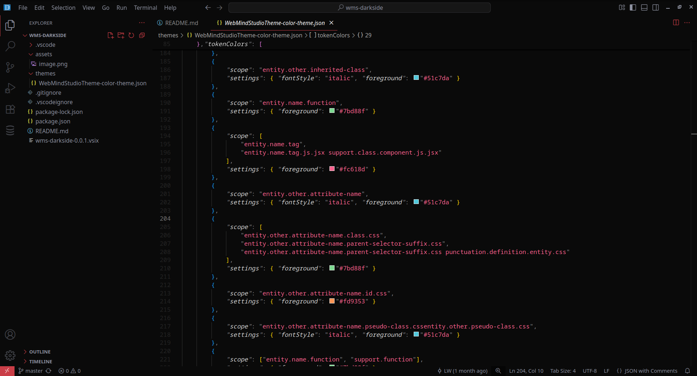

<h1 align="center">🖤🔥 WebMindStudioTheme for Visual Studio Code 🔥🖤</h1>

  <strong>A dark, elegant, high-contrast theme with refined black and red accents. Perfect for night coding and a sleek cyberpunk aesthetic.</strong>

  <strong>Editor View</strong> 
  

---

<h2>✨ Features</h2>

<ul>
  <li>Deep near-black backgrounds (#0a0a0a, #0f0f0f) reduce eye strain</li>
  <li>Vibrant red highlights (#ca3e47) for UI focus and syntax accents</li>
  <li>Subtle cool grays (#8F93A2, #212121) balance the palette</li>
  <li>Professional design for JavaScript, Python, HTML, CSS, TypeScript, and more</li>
  <li>OLED-friendly deep blacks, minimalist styling</li>
</ul>

---

<h2>🎨 Color Palette</h2>

<ul>
  <li><strong>Primary Backgrounds:</strong> #0a0a0a, #0f0f0f</li>
  <li><strong>Selection / Panels:</strong> #212121, #262626</li>
  <li><strong>Accent Red:</strong> #ca3e47 (buttons, borders, activity bar, highlights)</li>
  <li><strong>Foreground:</strong> #8F93A2 (text), #d7d7d7 (source)</li>
  <li><strong>Comments:</strong> #696969 (italic)</li>
  <li><strong>Syntax Highlights:</strong>
    <ul>
      <li>Keywords / Tags: #fc618d</li>
      <li>Functions / Entities: #7bd88f</li>
      <li>Constants / Numbers: #af98e6</li>
      <li>Strings: #e3cf65</li>
      <li>Variables / Members: #d7d7d7</li>
    </ul>
  </li>
</ul>

---

<h2>🛠️ Installation</h2>

<h3>1️⃣ Install via .vsix File</h3>
<ol>
  <li>Download the latest <code>.vsix</code> release from the <a href="https://github.com/ShitCodeTech/wms-darkside/releases">GitHub Releases</a>.</li>
  <li>In VSCode, open the Command Palette (<code>Ctrl+Shift+P</code>).</li>
  <li>Run <strong>Extensions: Install from VSIX...</strong>.</li>
  <li>Select your downloaded <code>.vsix</code> file.</li>
  <li>Apply via <strong>Preferences → Color Theme</strong>.</li>
</ol>

<h3>2️⃣ Build & Install Manually</h3>
<ol>
  <li>Clone the repository:</li>
  <pre><code>git clone https://github.com/ShitCodeTech/wms-darkside.git</code></pre>
  <li>Navigate to the folder:</li>
  <pre><code>cd wms-darkside</code></pre>
  <li>Install dependencies (if needed):</li>
  <pre><code>npm install</code></pre>
  <li>Package the extension:</li>
  <pre><code>npx vsce package</code></pre>
  <li>Install the generated <code>.vsix</code> as above.</li>
</ol>

---

<h2>💡 Why Choose WebMindStudioTheme?</h2>

  WebMindStudioTheme is for developers who want a sleek, modern, high-contrast environment without blinding brightness. Its deep blacks save your eyes (and your OLED screen). The accent red (#ca3e47) provides focus cues without overwhelming. Carefully balanced grays ensure excellent readability.

---

<h2>🚀 Keywords</h2>

  black red vscode theme, dark red vscode color scheme, red accent vscode theme, hacker vscode theme, cyberpunk vscode theme, OLED-friendly vscode theme, high-contrast vscode color theme

---

<h2>🤝 Contributing</h2>

  Feedback and pull requests are welcome!

---

  <strong>🌌 Transform your coding experience with WebMindStudioTheme! 🌌</strong>

